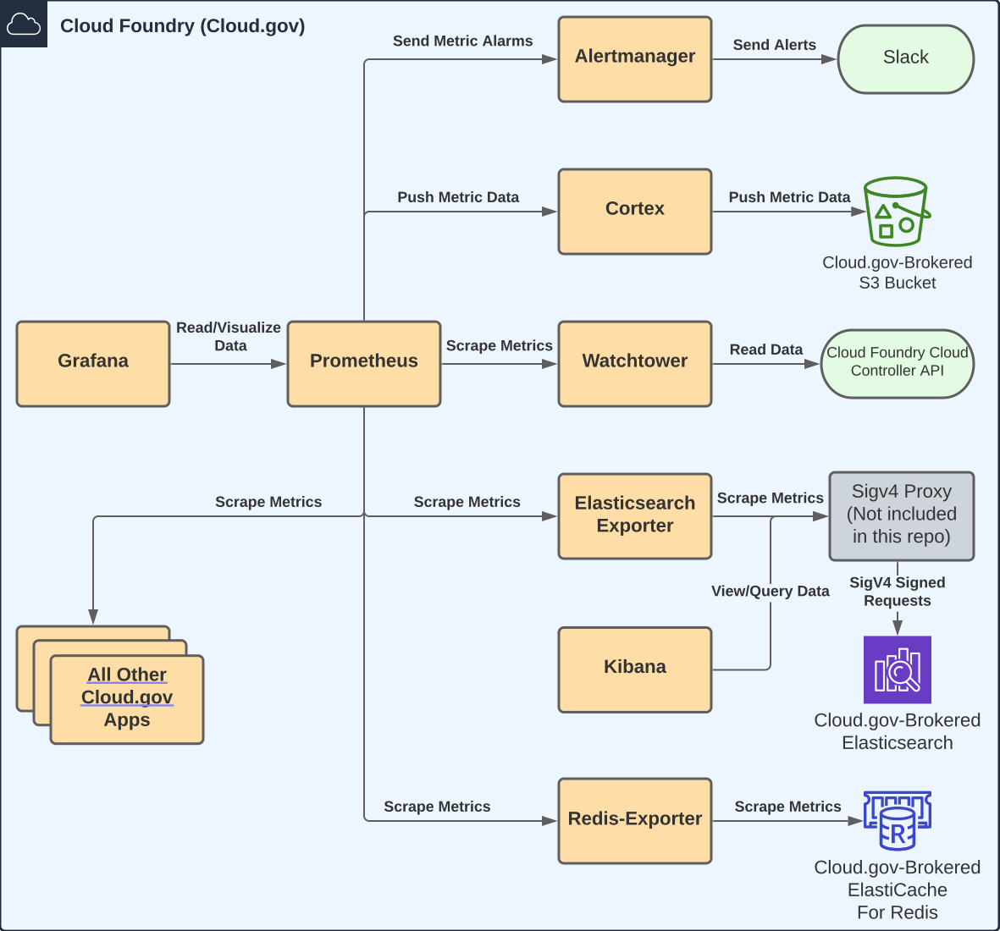

# IDVA Monitoring Service
Monitoring for IDVA microservices in cloud.gov

## Why this project
The IDVA project is composed of many different microservices, each needing to
be monitored for performance, stability, and uptime. The monitoring
microservice has the following goals:
* Provide monitoring capabilities for IDVA microservices
* Alert IDVA operators/admins on specified metric thresholds

## Architecture Overview


## Implementation
IDVA monitoring is a set of monitoring tools that get deployed together to enable
monitoring of the IDVA system. The repo is broken down by tool and contains:
* Prometheus: an HA Prometheus setup to monitor applications based on DNS querying
of the application routes. 
  * For all applications we wish to monitor, adding a `dns_sd_config` within the
  [prometheus-config.yml](#prometheus-config.yml) adds the application to prometheus's
  monitoring. By using the `dns_sd_config` we are able to see and query **all** instances
  of the application, and are not load balanced to random instances every query.
* Grafana: A simple dashboard setup to view some of the IDVA metrics in real-time
* Alertmanager: an HA Alertmanager cluster that handles alert deduplication and routing.
* Cortex: A single-binary-mode Cortex instance for shipping metrics to S3 for long-term storage.
* Watchtower: A run-anywhere, Cloud Foundry drift detection service (designed to be scraped by Prometheus).
* Kibana: Basic Kibana setup for quickly querying elasticsearch data in cloud.gov
* Elasticsearch: A Prometheus exporter for Elasticsearch metrics on cloud.gov
* Redis: A Prometheus Exporter for Redis metrics on cloud.gov

## Generating the config files
The config files are generic to prevent having to have multiple configuration files
per space (dev, test, prod, etc). The <tool-name>-config.yml files are intended to be
fed to `envsubst` after the appropriate environment variable has been set. The config
should be output to the appropriate named files (see examples below).
```shell
# Examples of config file generation using envsubst
envsubst < prometheus/prometheus-config.yml > prometheus/prometheus.yml
envsubst < alertmanager/alert-config.yml > alertmanager/alertmanager.yml
```

## CI/CD Workflows with GitHub Actions
The most up-to-date information about the CI/CD flows for this repo can be found in the
[GitHub workflows directory](https://github.com/18F/identity-idva-monitoring/tree/main/.github/workflows)

## Public domain

This project is in the worldwide [public domain](LICENSE.md). As stated in
[CONTRIBUTING](CONTRIBUTING.md):

> This project is in the public domain within the United States, and copyright
and related rights in the work worldwide are waived through the
[CC0 1.0 Universal public domain dedication](https://creativecommons.org/publicdomain/zero/1.0/).
>
> All contributions to this project will be released under the CC0 dedication.
By submitting a pull request, you are agreeing to comply with this waiver of
copyright interest.
